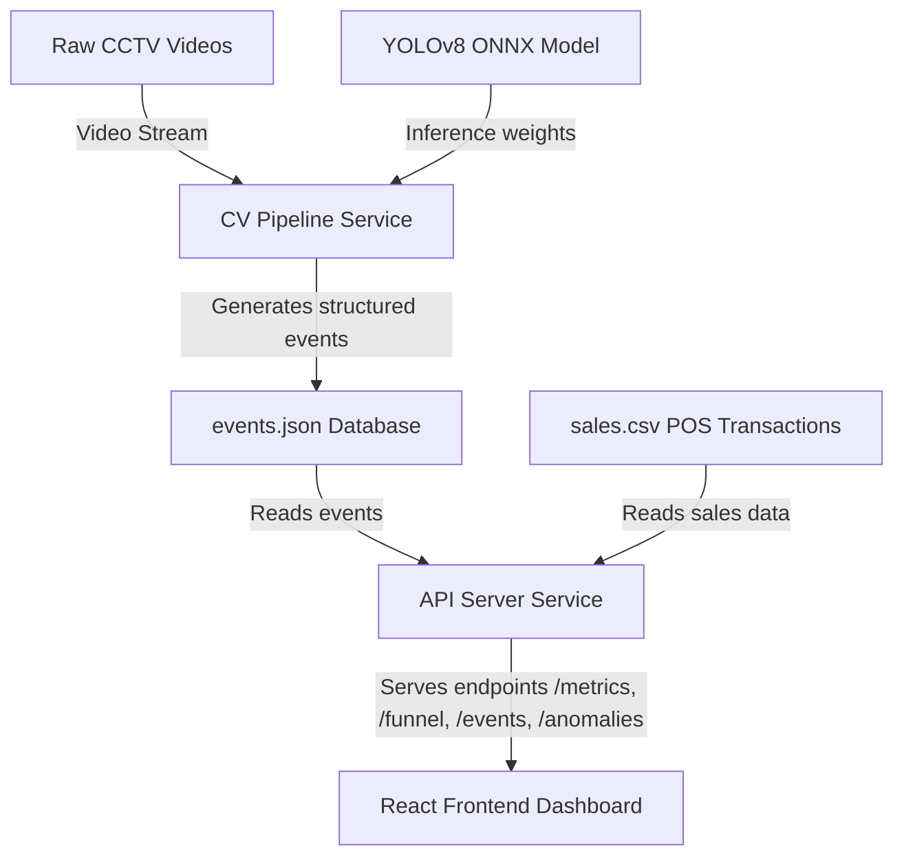

# System Architecture (DESIGN.md)

This document describes the data flow, component design, and event schemas for the Purplle Store Intelligence System.

## 1. System Architecture Diagram



## 2. Component Descriptions

### A. CV Pipeline Service (Python)
*   **Video Loader**: Iterates over the five camera videos.
*   **Detector**: Runs OpenCV DNN with `yolov8n.onnx` on the person class (class ID 0) at regular frame intervals.
*   **Centroid Tracker**: Matches detected bounding boxes across frames to assign persistent IDs (`person_id`).
*   **Spatial Event Manager**: Computes coordinate intersections:
    *   **CAM 3**: Detects entrance boundary crossings.
    *   **CAM 1**: Tracks dwell time in the Skin Care section and brand shelves.
    *   **CAM 2**: Tracks dwell time in the Makeup/Hair sections.
    *   **CAM 5**: Tracks cashier area presence.
    *   **CAM 4**: Detects backroom intrusion events.

### B. API Server (Node.js/Express)
*   **Data Aggregator**: Merges POS transactions from the sales CSV with the tracking events from the shared volume.
*   **Session Tracker**: Groups individual events by temporal proximity to reconstruct visitor journeys.
*   **Funnel Analyzer**: Computes the progression of visitor sessions:
    `Entered (CAM 3) -> Browsed (CAM 1 / CAM 2) -> Checkout Area (CAM 5) -> Transacted (Sales CSV)`
*   **Anomaly Detector**: Identifies events like:
    *   Backroom intrusions (CAM 4 activity).
    *   Checkout without purchase (lost conversion).
    *   Sudden visitor spikes (group entries).

### C. Frontend Dashboard (React)
*   A premium, responsive dark-themed dashboard.
*   Shows overall store metrics, live event streams, funnel analysis, and a visual heatmap overlay of the store layout showing brand engagement levels.

## 3. Event Schema Reference

All events are appended to `events.json` in the following format:

```json
{
  "event_id": "evt_1714562410a8b",
  "timestamp": "2026-04-10T20:10:15.000Z",
  "relative_seconds": 15.4,
  "camera_id": "CAM 3",
  "person_id": 4,
  "action": "enter",
  "details": {
    "section": "entrance",
    "group_entry": false
  }
}
```

### Action Types:
*   `enter` / `exit`: Triggered at the main entrance (CAM 3).
*   `browse_start` / `browse_end`: Triggered when a visitor dwells in front of brand shelves (CAM 1 / CAM 2).
*   `checkout_start` / `checkout_end`: Triggered at the cash counter (CAM 5).
*   `backroom_intrusion`: Triggered when activity is detected in the backroom (CAM 4).
