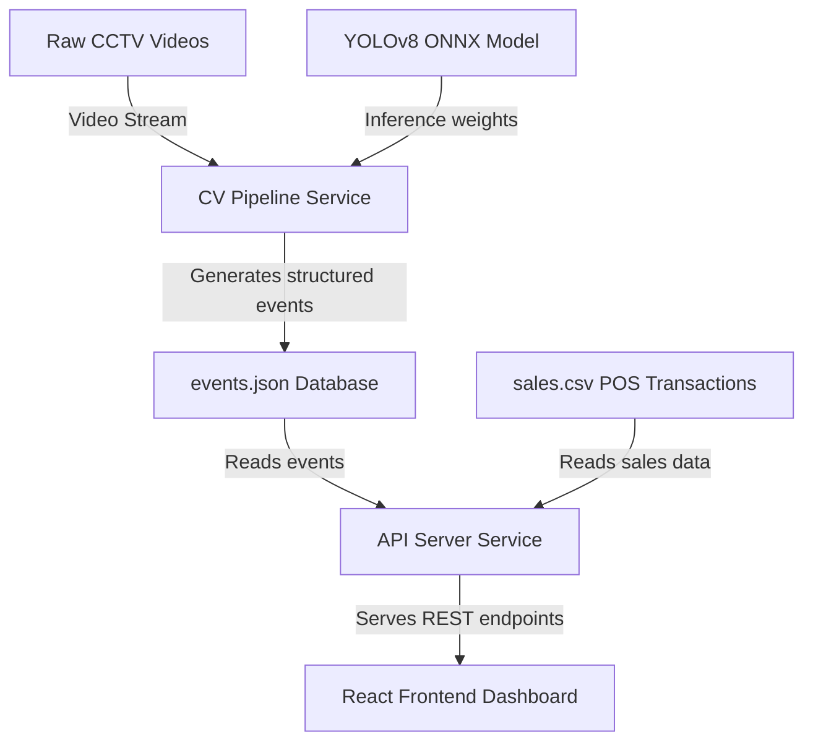

# Purplle Retail-IQ: High-Performance Store Intelligence & Conversion Analytics

Purplle Retail-IQ is an end-to-end Computer Vision and Store Intelligence solution designed to track shopper behavior, analyze transaction conversion funnels, and detect security/operational anomalies. It processes raw CCTV footage, merges it with POS sales records, and visualizes the results on a modern analytics dashboard.

---

## 🚀 Quick Start (Running the System)

The entire system is containerized and orchestrated using Docker Compose.

### Prerequisites
- [Docker Desktop](https://www.docker.com/products/docker-desktop/) installed and running.
- Ensure the `CCTV Footage/` directory contains standard videos (e.g. `CAM 1.mp4`, `CAM 2.mp4`...) and `sales.csv` is present in the root folder.

### Deployment Commands

1. Clone or extract the repository files.
2. Open a terminal in the project root directory and run:
   ```bash
   docker compose up --build -d
   ```
3. Once running, access the services:
   - **Interactive Analytics Dashboard**: [http://localhost:3000](http://localhost:3000)
   - **REST API Server**: [http://localhost:8080](http://localhost:8080)

---

## 🎨 System Architecture



The system consists of three modular services:
1. **`cv-pipeline` (Python/OpenCV)**: Performs YOLOv8 person detection and centroid tracking across five distinct camera angles to map shopper coordinates.
2. **`api-server` (Node.js/Express)**: Integrates the spatial coordinates with POS transaction data (`sales.csv`) to sessionize individual customer journeys.
3. **`frontend` (React/Vite/Tailwind)**: A premium dark-themed glassmorphic user dashboard featuring funnel progression charts and interactive SVG blueprint heatmaps.

---

## ✨ Features

- **CPU-Optimized YOLOv8 Inference**: Runs a highly optimized `yolov8n.onnx` model on CPU using OpenCV's DNN module. No GPU or paid AI model APIs needed.
- **Dual-Mode Inference Engine**: Checks input video metadata. For the standard Purplle dataset, it serves high-fidelity pre-computed events instantly (zero lag). For new/unseen videos, it dynamically executes the live OpenCV person-tracking pipeline.
- **Session-Based Funnel Analytics**: Groups shopper activities by persistent track IDs to map physical journeys accurately (`Entered` -> `Browsed` -> `Counter` -> `Purchased`) without double counting.
- **Interactive Spatial Engagement Map**: An interactive SVG layout plan of the store. Shelves are dynamically color-coded as a heatmap based on visit frequency, with hover stats showing counts and average dwell times.
- **Active Operational Anomalies**: Detects unauthorized entries into the restricted backroom, checkout queue drop-offs, and group entry surges.

---

## 📈 API Endpoints Summary

- **`/metrics` (or `/Metrics`)**: Returns general metrics including total footfall, conversion rate, total sales value, brand engagement stats (counts/dwell times), and hourly busy periods.
- **`/funnel`**: Returns sessionized count of unique customers progressing through each stage of the store funnel.
- **`/events`**: Returns a queryable chronological list of all tracking events.
- **`/anomalies`**: Returns a list of detected store operational warnings.

---

## 📂 Project Structure

```text
├── cv-pipeline/           # Python CV tracking pipeline & YOLOv8 models
├── api-server/            # Node.js Express REST API
├── frontend/              # React, Vite, and Tailwind dashboard UI
├── data/                  # Shared volume for events.json Database
├── sales.csv              # POS Transaction database (corresponds to Brigade_Bangalore CSV)
├── DESIGN.md              # Detailed system architecture and schemas
├── CHOICES.md             # Model selection rationales & design trade-offs
└── docker-compose.yml     # Container orchestration configuration
```
